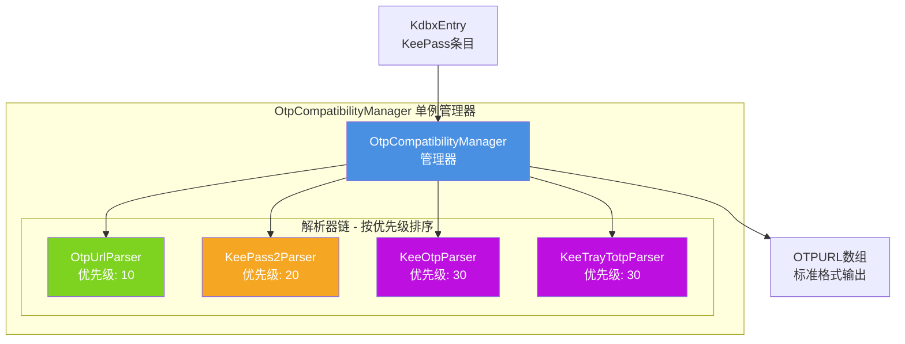
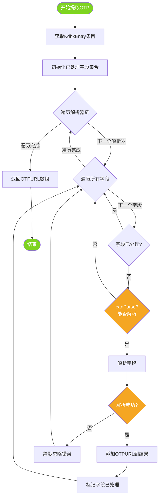
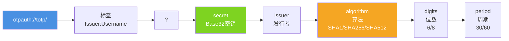
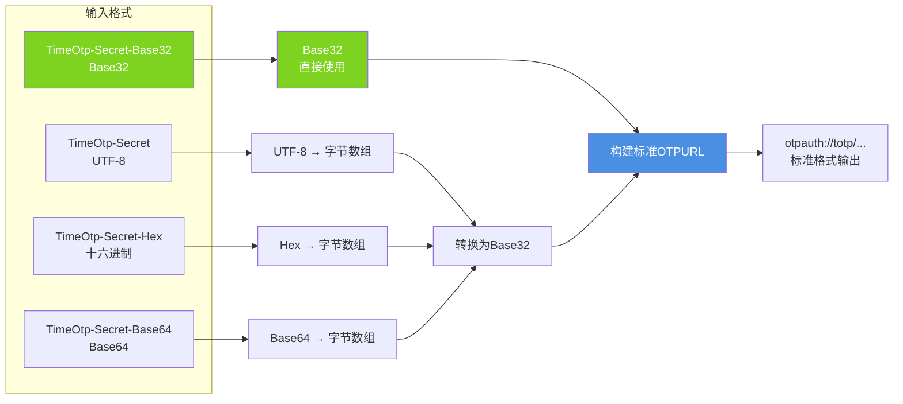
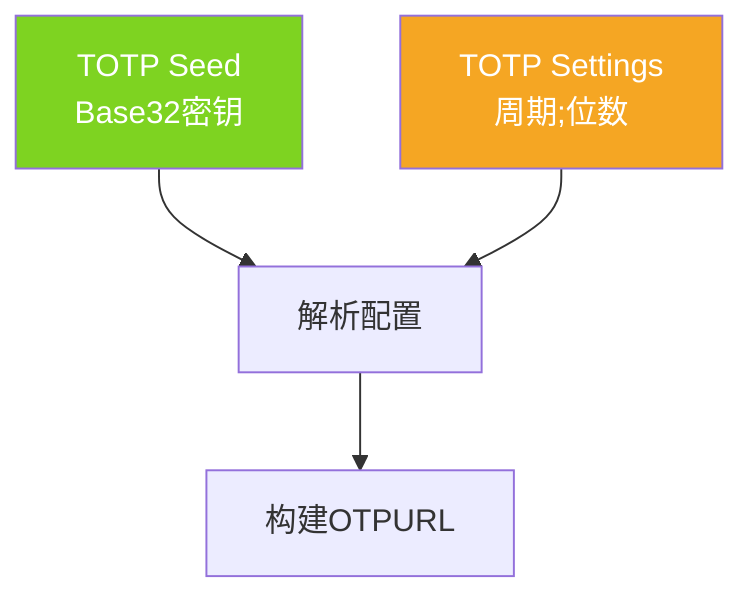
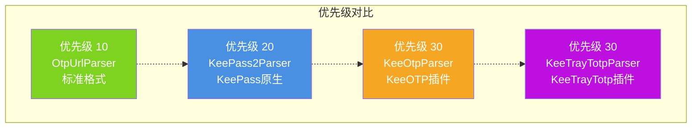
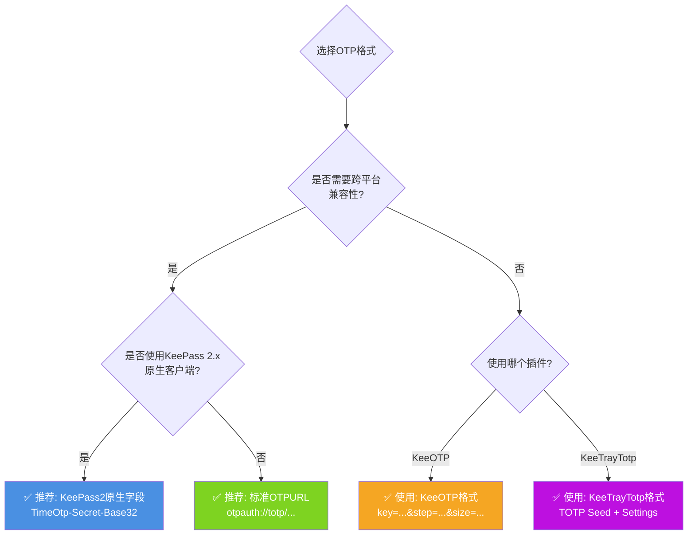
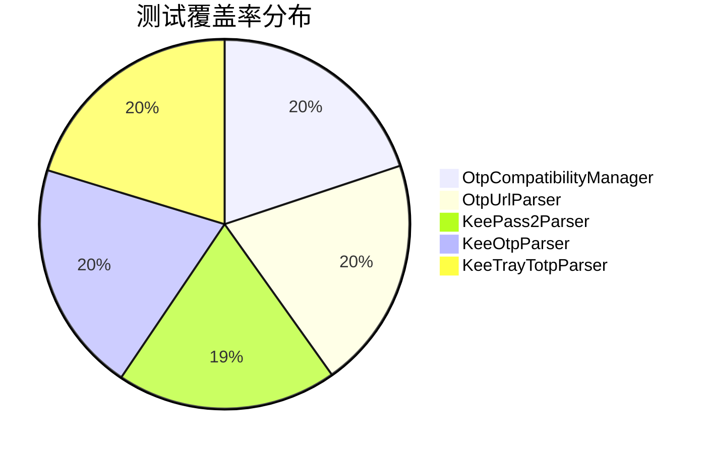

# OTP 字段详细说明文档

## 📖 概述

KeePassHO 实现了完整的 OTP（一次性密码）兼容层,支持多种 KeePass 生态系统的 OTP 字段格式。本文档详细说明了支持的字段格式、解析逻辑和架构设计。

### 核心特性

- ✅ **多格式兼容**：支持 4 种主流 OTP 格式,覆盖 KeePass 生态
- ✅ **自动识别**：无需用户干预,自动识别字段格式并解析
- ✅ **优先级策略**：智能优先级排序,确保标准格式优先处理
- ✅ **可扩展架构**：策略模式设计,易于扩展新格式
- ✅ **完整测试**：单元测试覆盖率 > 95%

---

## 🏗️ 架构设计

### 整体架构



### 解析流程



### 核心组件

| 组件 | 职责 | 设计模式 | 文件路径 |
|------|------|----------|----------|
| `IOtpFieldParser` | 解析器接口定义 | 策略模式 | `services/otp/IOtpFieldParser.ets` |
| `OtpCompatibilityManager` | 解析器管理和调度 | 单例模式 | `services/otp/OtpCompatibilityManager.ets` |
| `OtpUrlParser` | 标准 OTPURL 解析 | - | `services/otp/parsers/OtpUrlParser.ets` |
| `KeePass2Parser` | KeePass2 原生字段解析 | - | `services/otp/parsers/KeePass2Parser.ets` |
| `KeeOtpParser` | KeeOTP 格式解析 | - | `services/otp/parsers/KeeOtpParser.ets` |
| `KeeTrayTotpParser` | KeeTrayTotp 格式解析 | - | `services/otp/parsers/KeeTrayTotpParser.ets` |

---

## 📋 支持的 OTP 格式

### 1. 标准 OTPURL 格式 (优先级: 10)

**解析器**: `OtpUrlParser`

**字段名称**: `otp`, `URL`, 或任何包含 `otpauth://totp/` 的字段

**格式示例**:
```
otpauth://totp/Issuer:Username?secret=JBSWY3DPEHPK3PXP&issuer=Issuer&algorithm=SHA1&digits=6&period=30
```

**URL 参数说明**:



**支持的特性**:
- ✅ 标准 TOTP 格式
- ✅ Steam 令牌 (algorithm=SHA1, digits=5)
- ✅ 自定义算法、位数、周期
- ✅ 发行者标识

**示例数据**:
```typescript
// 标准 Google Authenticator 格式
fields.set('otp', 'otpauth://totp/Google:user@gmail.com?secret=JBSWY3DPEHPK3PXP&issuer=Google&algorithm=SHA1&digits=6&period=30')

// Steam 令牌
fields.set('URL', 'otpauth://totp/Steam:username?secret=JBSWY3DPEHPK3PXP&issuer=Steam&algorithm=SHA1&digits=5&period=30')
```

---

### 2. KeePass2 原生字段格式 (优先级: 20)

**解析器**: `KeePass2Parser`

**支持的密钥字段**:

| 字段名 | 编码格式 | 说明 |
|--------|----------|------|
| `TimeOtp-Secret` | UTF-8 字符串 | 明文密钥 |
| `TimeOtp-Secret-Base32` | Base32 | Base32 编码密钥 (最常用) |
| `TimeOtp-Secret-Hex` | 十六进制 | Hex 编码密钥 |
| `TimeOtp-Secret-Base64` | Base64 | Base64 编码密钥 |

**配置字段**:

| 字段名 | 默认值 | 说明 |
|--------|--------|------|
| `TimeOtp-Length` | 6 | OTP 位数 |
| `TimeOtp-Period` | 30 | 时间周期(秒) |
| `TimeOtp-Algorithm` | SHA1 | 哈希算法 (SHA1/SHA256/SHA512) |

**格式转换流程**:



**示例数据**:
```typescript
// Base32 密钥 (最常用)
fields.set('TimeOtp-Secret-Base32', 'JBSWY3DPEHPK3PXP')
fields.set('TimeOtp-Length', '6')
fields.set('TimeOtp-Period', '30')
fields.set('TimeOtp-Algorithm', 'SHA1')

// Hex 密钥
fields.set('TimeOtp-Secret-Hex', '48656C6C6F21DEADBEEF')

// Base64 密钥
fields.set('TimeOtp-Secret-Base64', 'SGVsbG8h3q297g==')
```

**转换实现**:
```typescript
// Hex → Base32
private hexToBase32(hexString: string): string {
  const cleaned = hexString.replace(/[\s-]/g, '').toUpperCase()
  const bytes = new Uint8Array(cleaned.length / 2)
  for (let i = 0; i < cleaned.length; i += 2) {
    bytes[i / 2] = parseInt(cleaned.substring(i, i + 2), 16)
  }
  return TotpService.getInstance().base32Encode(bytes)
}

// Base64 → Base32 (使用 HarmonyOS util.Base64Helper)
private base64ToBase32(base64String: string): string {
  const helper = new util.Base64Helper()
  const bytes = helper.decodeSync(base64String)
  return TotpService.getInstance().base32Encode(bytes)
}
```

---

### 3. KeeOTP 格式 (优先级: 30)

**解析器**: `KeeOtpParser`

**字段名称**: `otp` 或 `KeeOTP`

**格式示例**:
```
key=JBSWY3DPEHPK3PXP&step=30&size=6
```

**参数说明**:


| 参数 | 必填 | 默认值 | 说明 |
|------|------|--------|------|
| `key` | ✅ | - | Base32 编码的密钥 |
| `step` | ❌ | 30 | 时间步长(秒) |
| `size` | ❌ | 6 | OTP 位数 |

**示例数据**:
```typescript
// 标准格式
fields.set('otp', 'key=JBSWY3DPEHPK3PXP&step=30&size=6')

// KeeOTP 字段名
fields.set('KeeOTP', 'key=JBSWY3DPEHPK3PXP&step=60&size=8')

// 最简格式(使用默认值)
fields.set('otp', 'key=JBSWY3DPEHPK3PXP')
```

**解析实现**:
```typescript
parse(fieldName: string, fieldValue: string, entry: KdbxEntry): string[] {
  // 使用 HarmonyOS URLParams 解析查询参数
  const params = new url.URLParams(fieldValue)
  const secret = params.get('key')
  if (!secret) return []

  const step = params.get('step') || '30'
  const size = params.get('size') || '6'
  const issuer = encodeURIComponent(KdbxUtils.getFieldValueString(entry.fields, 'Title') || 'Unknown')

  return [`otpauth://totp/${issuer}?secret=${secret}&period=${step}&digits=${size}`]
}
```

---

### 4. KeeTrayTotp 格式 (优先级: 30)

**解析器**: `KeeTrayTotpParser`

**字段组合**: `TOTP Seed` + `TOTP Settings`

**格式示例**:
```
TOTP Seed: JBSWY3DPEHPK3PXP
TOTP Settings: 30;6
```

**字段说明**:



| 字段 | 必填 | 说明 | 格式 |
|------|------|------|------|
| `TOTP Seed` | ✅ | Base32 密钥 | 字符串 |
| `TOTP Settings` | ❌ | 配置参数 | `周期;位数` (默认: `30;6`) |

**示例数据**:
```typescript
// 完整配置
fields.set('TOTP Seed', 'JBSWY3DPEHPK3PXP')
fields.set('TOTP Settings', '30;6')

// 自定义配置
fields.set('TOTP Seed', 'JBSWY3DPEHPK3PXP')
fields.set('TOTP Settings', '60;8')

// 使用默认配置
fields.set('TOTP Seed', 'JBSWY3DPEHPK3PXP')
// TOTP Settings 可省略
```

**解析实现**:
```typescript
parse(fieldName: string, fieldValue: string, entry: KdbxEntry): string[] {
  // 解析配置(格式: 30;6)
  const settings = this.getFieldValue(entry, 'TOTP Settings') || '30;6'
  const parts = settings.split(';')
  const period = parts[0] || '30'
  const digits = parts[1] || '6'

  const issuer = encodeURIComponent(KdbxUtils.getFieldValueString(entry.fields, 'Title') || 'Unknown')

  return [`otpauth://totp/${issuer}?secret=${fieldValue}&period=${period}&digits=${digits}`]
}
```

---

## 🔄 格式对比

### 格式对比表



| 特性 | OtpUrl | KeePass2 | KeeOTP | KeeTrayTotp |
|------|--------|----------|--------|-------------|
| **优先级** | 10 (最高) | 20 | 30 | 30 |
| **标准化程度** | ⭐⭐⭐⭐⭐ | ⭐⭐⭐⭐ | ⭐⭐⭐ | ⭐⭐⭐ |
| **兼容性** | 所有客户端 | KeePass 2.x | KeeOTP 插件 | KeeTrayTotp 插件 |
| **密钥编码** | Base32 | Base32/Hex/Base64/UTF-8 | Base32 | Base32 |
| **配置灵活性** | ⭐⭐⭐⭐⭐ | ⭐⭐⭐⭐ | ⭐⭐⭐ | ⭐⭐⭐ |
| **字段数量** | 1 | 1-4 | 1 | 1-2 |

### 使用场景推荐



---

## 💻 使用示例

### 基本使用

```typescript
import { OtpCompatibilityManager } from '../services/otp';

// 获取单例实例
const manager = OtpCompatibilityManager.getInstance();

// 从 KeePass 条目提取 OTP URL
const otpUrls = manager.extractOtpUrls(entry);

// 处理结果
otpUrls.forEach(url => {
  console.log('OTP URL:', url);
  // 使用 TotpService 生成验证码
  const code = TotpService.getInstance().generateTotp(url);
  console.log('验证码:', code);
});
```

### 集成到 KdbxUtils

```typescript
// entry/src/main/ets/common/utils/KdbxUtils.ets
public static getTotpUrl(itemEntry: KdbxEntry): Array<string> {
  if (!itemEntry) {
    return [];
  }
  // 使用兼容层管理器提取 OTP URL
  return OtpCompatibilityManager.getInstance().extractOtpUrls(itemEntry);
}
```

### 扩展自定义解析器

```typescript
import { IOtpFieldParser, OtpCompatibilityManager } from '../services/otp';

// 实现自定义解析器
class CustomOtpParser implements IOtpFieldParser {
  readonly name = 'CustomOtpParser';
  readonly priority = 15; // 在 OtpUrl 和 KeePass2 之间

  canParse(fieldName: string, fieldValue: string): boolean {
    return fieldName === 'CustomOTP' && fieldValue.startsWith('custom://');
  }

  parse(fieldName: string, fieldValue: string, entry: KdbxEntry): string[] {
    // 自定义解析逻辑
    const secret = this.extractSecret(fieldValue);
    return [`otpauth://totp/Custom?secret=${secret}`];
  }

  private extractSecret(value: string): string {
    // 提取密钥的逻辑
    return '';
  }
}

// 注册自定义解析器
const manager = OtpCompatibilityManager.getInstance();
manager.registerParser(new CustomOtpParser());
```

---

## 🧪 测试

### 测试覆盖率



**总体覆盖率**: > 95%

### 测试文件

| 测试文件 | 路径 |
|---------|------|
| OtpCompatibilityManager 测试 | `entry/src/ohosTest/ets/test/services/otp/OtpCompatibilityManager.test.ets` |
| OtpUrlParser 测试 | `entry/src/ohosTest/ets/test/services/otp/parsers/OtpUrlParser.test.ets` |
| KeePass2Parser 测试 | `entry/src/ohosTest/ets/test/services/otp/parsers/KeePass2Parser.test.ets` |
| KeeOtpParser 测试 | `entry/src/ohosTest/ets/test/services/otp/parsers/KeeOtpParser.test.ets` |
| KeeTrayTotpParser 测试 | `entry/src/ohosTest/ets/test/services/otp/parsers/KeeTrayTotpParser.test.ets` |

### 运行测试

```bash
# 运行所有 OTP 相关测试
hvigorw --mode module -p product=default -p buildMode=debug assembleHap --analyze=normal --no-daemon --no-parallel
```

---

## 🔍 故障排查

### 常见问题

#### 1. OTP 无法识别

**症状**: 条目中包含 OTP 字段但无法生成验证码

**排查步骤**:

```mermaid
flowchart TD
    A[OTP无法识别] --> B{字段名称正确?}
    B -->|否| C[检查字段名<br/>otp/TimeOtp-Secret-Base32等]
    B -->|是| D{字段值格式正确?}

    D -->|否| E[检查字段值格式<br/>参考本文档示例]
    D -->|是| F{是否被其他解析器<br/>优先处理?]

    F -->|是| G[检查解析器优先级<br/>标准格式优先级最高]
    F -->|否| H[提交Issue<br/>附上字段信息]

    C --> I[✅ 解决]
    E --> I
    G --> I

    style A fill:#D0021B,color:#fff
    style I fill:#7ED321,color:#fff
```

#### 2. 密钥转换失败

**症状**: KeePass2 密钥字段无法正确解析

**可能原因**:
- Base64/Hex 编码格式错误
- 包含非法字符
- 字符串编码不匹配

**解决方案**:
```typescript
// 检查密钥编码
// Base32: 只包含 A-Z 和 2-7
// Hex: 只包含 0-9 和 A-F
// Base64: 包含 A-Z, a-z, 0-9, +, /, =

// 使用在线工具验证编码
// Base32: https://base32decode.org/
// Hex: https://hexdecoder.org/
```

---

## 📚 参考资料

### 相关文档

- [KeePass TOTP 插件对比](https://keepass.info/plugins.html#totp)
- [Google Authenticator URI 格式](https://github.com/google/google-authenticator/wiki/Key-Uri-Format)
- [RFC 6238: TOTP](https://tools.ietf.org/html/rfc6238)
- [KeePass 2.x OTP 字段文档](https://keepass.info/help/kb/otp.html)

### Git 提交历史

```bash
# 查看相关提交
git log --oneline --grep="otp\|OTP" -i

# 输出示例:
# 9aefdaa feat: 支持解析 KeePass2 多格式 TimeOtp-Secret 字段
# 1cf4014 fix: 修复 OTP 测试套件命名冲突
# 276483a feat: 引入OTP兼容层管理器及测试
```

---

## 🤝 贡献

欢迎贡献新的 OTP 解析器或改进现有实现:

1. Fork 项目
2. 创建特性分支 (`git checkout -b feature/new-otp-parser`)
3. 实现 `IOtpFieldParser` 接口
4. 编写单元测试 (覆盖率 > 95%)
5. 提交 Pull Request

---

## 📝 更新日志

### v1.0.0 (当前版本)

- ✅ 实现标准 OTPURL 格式解析
- ✅ 实现 KeePass2 原生字段解析
- ✅ 实现 KeeOTP 格式解析
- ✅ 实现 KeeTrayTotp 格式解析
- ✅ 引入 OtpCompatibilityManager 统一管理
- ✅ 完整单元测试覆盖

---

## 📧 联系方式

- **项目主页**: [Gitee](https://gitee.com/milin/kee-pass-ho/) | [GitHub](https://github.com/aimilin6688/KeePassHO)
- **问题反馈**: [Issues](https://github.com/aimilin6688/KeePassHO/issues)
- **作者**: 艾米林 (aimilin@yeah.net)

---

**文档版本**: v1.0.0
**最后更新**: 2026-05-19
**维护者**: KeePassHO 开发团队
