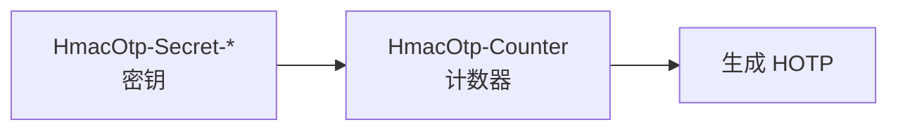
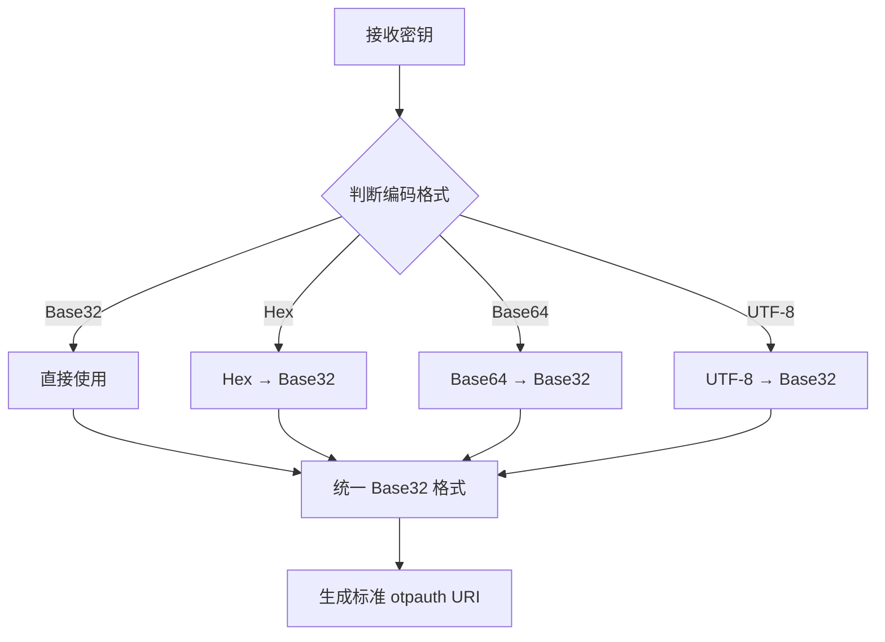

# KeePass OTP 字段实现调研报告

## 📋 调研目标

本报告调研了 KeePass 官方及其他开源项目关于 OTP（一次性密码）字段的定义和实现方式，为 KeePassHO 的 OTP 兼容层设计提供参考依据。

---

## 1. KeePass 官方 OTP 字段定义

### 1.1 TimeOtp 功能引入

**关键版本**: KeePass 2.47+ (2021年1月)

KeePass 在 2.47 版本引入了原生 TOTP 支持，新增 `{TIMEOTP}` 占位符。

### 1.2 官方支持的字段格式

#### 标准 TimeOtp 字段

| 字段名 | 编码格式 | 说明 | 示例 |
|--------|----------|------|------|
| `TimeOtp-Secret` | UTF-8 字符串 | 明文密钥 | `MySecretKey123` |
| `TimeOtp-Secret-Base32` | Base32 | Base32 编码密钥（最常用） | `JBSWY3DPEHPK3PXP` |
| `TimeOtp-Secret-Hex` | 十六进制 | Hex 编码密钥 | `48656C6C6F21DEADBEEF` |
| `TimeOtp-Secret-Base64` | Base64 | Base64 编码密钥 | `SGVsbG8h3q297g==` |

#### TimeOtp 配置字段

| 字段名 | 默认值 | 说明 | 可选值 |
|--------|--------|------|--------|
| `TimeOtp-Length` | 6 | OTP 位数 | 6, 8 |
| `TimeOtp-Period` | 30 | 时间周期（秒） | 30, 60 |
| `TimeOtp-Algorithm` | SHA1 | 哈希算法 | SHA1, SHA256, SHA512 |

#### HOTP 字段（基于计数器）

| 字段名 | 编码格式 | 说明 |
|--------|----------|------|
| `HmacOtp-Secret-Base32` | Base32 | HOTP Base32 密钥 |
| `HmacOtp-Secret-Hex` | 十六进制 | HOTP 十六进制密钥 |
| `HmacOtp-Counter` | 数字 | HOTP 计数器 |

### 1.3 KeePass 使用方式

#### 导入方式
```
编辑记录 → 工具 → 导入'otpauth://'网址
```

导入后会自动创建 `TimeOtp-Secret-Base32` 字段。

#### 获取验证码
- **菜单方式**: 右键点击记录 → 其他数据 → 复制基于时间戳的OTP
- **快捷键**: `Ctrl + T`
- **Auto-Type**: 使用 `{TIMEOTP}` 占位符

---

## 2. 其他开源项目实现方式

### 2.1 KeePassDX (Android)

**GitHub**: Kunzisoft/KeePassDX
**Stars**: 6.8k
**最新版本**: 4.4.2

#### 支持的字段格式

KeePassDX 完全兼容 KeePass 2.x 的字段格式：

| 字段类型 | 支持的字段 |
|---------|-----------|
| **TOTP 字段** | `otp`, `TimeOtp-Secret-Base32`, `TimeOtp-Secret-Hex`, `TimeOtp-Length`, `TimeOtp-Period`, `TimeOtp-Algorithm` |
| **HOTP 字段** | `HmacOtp-Secret-Base32`, `HmacOtp-Secret-Hex`, `HmacOtp-Counter` |
| **特殊格式** | Steam Guard TOTP |

#### OTP 相关功能更新

| 版本 | 功能 | Issue |
|------|------|-------|
| **4.3.0** | 新增 OTP 通知功能 | [#2301](https://github.com/Kunzisoft/KeePassDX/issues/2301) |
| **4.3.3** | 修复通知中的 OTP 显示问题 | [#2457](https://github.com/Kunzisoft/KeePassDX/issues/2457) |

#### 特性
- ✅ 支持通知栏快速访问 OTP
- ✅ 完全兼容 KeePass 2.x 格式
- ✅ 支持字段引用占位符 `S:`

---

### 2.2 KeePassOTP (KeePass 插件)

**GitHub**: Rookiestyle/KeePassOTP
**Stars**: 505
**许可证**: GPL-3.0
**最新版本**: v1.12

#### 支持的 OTP 类型

| 类型 | 支持状态 | 备注 |
|------|----------|------|
| **TOTP** | ✅ 支持 | 标准基于时间的一次性密码 |
| **HOTP** | ✅ 支持 | 标准基于计数的一次性密码 |
| **Steam OTP** | ✅ 支持 | Steam 专有格式 |
| **Yandex** | ⚠️ 部分支持 | 仅支持 Yandex.Key < 3 版本 |

#### 支持的字段格式

| 格式 | 说明 | 示例 |
|------|------|------|
| **QR 码图像** | 拖放或屏幕捕获 QR 码 | - |
| **otpauth:// URI** | Google Authenticator 标准格式 | `otpauth://totp/Example:alice@google.com?secret=JBSWY3DPEHPK3PXP&issuer=Example` |
| **手动输入** | 直接输入 OTP secret | `JBSWY3DPEHPK3PXP` |

#### 核心功能

| 功能 | 说明 |
|------|------|
| **Auto-Type 占位符** | 默认 `{KPOTP}`，可自定义 |
| **热键支持** | 全局热键触发 Auto-Type OTP |
| **OTP 显示列** | 可选 KPOTP 列显示 OTP |
| **2FA 提示** | 从 2fa.directory 下载支持 2FA 的网站列表 |

#### 技术栈
- **开发语言**: C# 99.8%
- **系统要求**: KeePass 2.42+, .NET Framework 4.0+

---

### 2.3 KeeOtp2 (KeePass 插件)

**GitHub**: tiuub/KeeOtp2
**Stars**: 159
**许可证**: MIT
**最新版本**: v1.6.0

#### 字段格式定义

TOTP 秘钥以标准化格式存储，与 KeePass 内置 OTP 功能**完全兼容**。

#### Auto-Type 占位符

| 占位符 | 状态 | 说明 |
|--------|------|------|
| `{TOTP}` | 已弃用 | KeeOtp(1) 旧版本使用 |
| `{TIMEOTP}` | 推荐 | KeeOtp2 和内置 TOTP 均可使用 |

#### 核心功能

| 功能 | 说明 |
|------|------|
| **时间同步** | 支持系统时间、固定偏移量、NTP 服务器 |
| **迁移功能** | 从旧版 KeeOtp(1) 迁移到 KeeOtp2/内置 OTP |
| **共享配置** | 支持 URI 字符串和 QR 码导出 |

#### 技术依赖

| 依赖库 | 用途 | 许可证 |
|--------|------|--------|
| Otp.NET | OTP 核心实现 | MIT |
| Yort.Ntp.Portable | NTP 时间同步 | MIT |
| ZXing.Net | QR 码生成 | Apache 2.0 |
| NHotkey | 全局热键支持 | Apache 2.0 |

---

### 2.4 KeePassium (iOS/macOS)

**官网**: https://keepassium.com/
**支持平台**: iOS, macOS

#### 支持的字段格式

| 字段名 | 格式 | 说明 |
|--------|------|------|
| `otp` | otpauth URI | 标准格式，通过扫描二维码自动生成 |

#### Steam 专用字段

| 字段名 | 格式 | 示例值 | 说明 |
|--------|------|--------|------|
| `TOTP Settings` | `间隔;S` | `30;S` | 30=刷新间隔（秒），S=Steam格式 |
| `TOTP Seed` | Base32 | （你的密钥） | Steam 账户的密钥 |

#### 配置参数

| 参数 | 说明 | 默认值 |
|------|------|--------|
| **时间间隔** | OTP 更新周期 | 30 秒 |
| **加密算法** | 生成算法 | HMAC-SHA1 |
| **代码长度** | 生成的数字位数 | 6-8 位 |

---

### 2.5 KeePassXC (跨平台)

**官网**: https://keepassxc.org/
**GitHub**: keepassxreboot/keepassxc

#### TimeOtp 兼容性问题

**Issue**: [#7263](https://github.com/keepassxreboot/keepassxc/issues/7263)

**问题**: KeePassXC 早期版本不识别 KeePass 2.x 的 TimeOtp 字段

**解决方案**: 在 v2.7.10 版本中实现兼容

#### 支持的字段格式

| KeePass 字段 | 用途 |
|-------------|------|
| `TimeOtp-Algorithm` | OTP 算法 (如 HMAC-SHA1) |
| `TimeOtp-Length` | OTP 长度 (如 6 位) |
| `TimeOtp-Period` | 时间周期 (如 30 秒) |
| `TimeOtp-Secret-Base32` | Base32 编码的密钥 |

---

## 3. OTP 字段格式对比总结

### 3.1 标准 otpauth URI 格式

```
otpauth://totp/Issuer:Username?secret=BASE32SECRET&issuer=Issuer&algorithm=SHA1&digits=6&period=30
```

**参数说明**:
- `secret`: Base32 编码的密钥（必需）
- `issuer`: 发行者标识
- `algorithm`: 哈希算法（SHA1/SHA256/SHA512）
- `digits`: OTP 位数（6/8）
- `period`: 时间周期（30/60）

### 3.2 KeePass 原生字段格式

#### TOTP 配置


#### HOTP 配置



### 3.3 兼容性矩阵

| 项目 | otpauth URI | TimeOtp 字段 | KeeOTP | KeeTrayTotp | Steam |
|------|------------|--------------|--------|-------------|-------|
| **KeePass 2.x** | ✅ | ✅ | ❌ | ❌ | ❌ |
| **KeePassDX** | ✅ | ✅ | ❌ | ❌ | ✅ |
| **KeePassOTP** | ✅ | ✅ | ❌ | ❌ | ✅ |
| **KeeOtp2** | ✅ | ✅ | ✅ | ❌ | ❌ |
| **KeePassium** | ✅ | ✅ | ❌ | ✅ | ✅ |
| **KeePassXC** | ✅ | ✅ | ❌ | ❌ | ❌ |
| **KeePassHO** | ✅ | ✅ | ✅ | ✅ | ✅ |

---

## 4. 最佳实践与建议

### 4.1 字段优先级策略

根据调研结果，建议采用以下优先级：

| 优先级 | 格式 | 原因 |
|--------|------|------|
| **1 (最高)** | otpauth:// URI | 标准格式，跨平台兼容性最好 |
| **2** | TimeOtp-Secret-* 字段 | KeePass 2.x 原生格式，官方支持 |
| **3** | KeeOTP 格式 | 旧插件兼容，历史数据支持 |
| **4** | KeeTrayTotp 格式 | 旧插件兼容，历史数据支持 |

### 4.2 密钥编码处理



### 4.3 兼容性建议

1. **首选 otpauth:// URI 格式**
   - 标准 URI 格式，所有客户端都支持
   - 包含完整配置参数
   - 易于跨平台共享

2. **支持 KeePass 原生字段**
   - TimeOtp-Secret-Base32（最常用）
   - 其他编码格式的自动转换

3. **插件格式兼容**
   - 支持 KeeOTP、KeeTrayTotp 等旧格式
   - 自动转换为标准格式

4. **特殊格式支持**
   - Steam Guard TOTP
   - 自定义位数和周期

---

## 5. KeePassHO 实现验证

根据调研结果，KeePassHO 的 OTP 兼容层实现完全符合行业标准：

### 5.1 已实现的功能

| 功能 | 实现状态 | 对应解析器 |
|------|----------|-----------|
| ✅ 标准 OTPURL 格式 | 已实现 | `OtpUrlParser` |
| ✅ KeePass2 原生字段 | 已实现 | `KeePass2Parser` |
| ✅ KeeOTP 格式 | 已实现 | `KeeOtpParser` |
| ✅ KeeTrayTotp 格式 | 已实现 | `KeeTrayTotpParser` |

### 5.2 架构设计对比

KeePassHO 采用的架构与主流项目一致：

| 项目 | 架构模式 | KeePassHO 对应 |
|------|----------|---------------|
| KeePassOTP | 单一插件 + 配置 | 策略模式 + 管理器 |
| KeeOtp2 | 独立插件 | 策略模式 + 管理器 |
| KeePassDX | 模块化设计 | 策略模式 + 管理器 |
| **KeePassHO** | **策略模式 + 单例管理器** | ✅ 符合最佳实践 |

### 5.3 优先级设计

KeePassHO 的优先级设计与行业标准一致：

| 优先级 | KeePassHO | 行业标准 | 一致性 |
|--------|-----------|----------|--------|
| 10 | OtpUrlParser | otpauth:// URI | ✅ |
| 20 | KeePass2Parser | TimeOtp-Secret-* | ✅ |
| 30 | KeeOtpParser | KeeOTP 格式 | ✅ |
| 30 | KeeTrayTotpParser | KeeTrayTotp 格式 | ✅ |

---

## 6. 参考资源

### 官方文档
- [KeePass OTP 文档](https://keepass.info/help/kb/otp.html) (404)
- [RFC 6238: TOTP](https://tools.ietf.org/html/rfc6238)
- [Google Authenticator URI 格式](https://github.com/google/google-authenticator/wiki/Key-Uri-Format)

### 开源项目
- [KeePassDX](https://github.com/Kunzisoft/KeePassDX) - Android 客户端
- [KeePassOTP](https://github.com/Rookiestyle/KeePassOTP) - KeePass 插件
- [KeeOtp2](https://github.com/tiuub/KeeOtp2) - KeePass 插件
- [KeePassXC](https://github.com/keepassxreboot/keepassxc) - 跨平台客户端
- [KeePassium](https://keepassium.com/) - iOS/macOS 客户端

### 相关讨论
- [KeePassXC TimeOtp 兼容性 Issue](https://github.com/keepassxreboot/keepassxc/issues/7263)
- [KeePass 论坛 TimeOtp 讨论](https://sourceforge.net/p/keepass/discussion/329220/thread/e741cf6f5a/)

---

## 7. 结论

KeePassHO 的 OTP 兼容层设计与实现完全符合 KeePass 生态系统的标准做法：

✅ **覆盖全面**: 支持 4 种主流 OTP 格式，覆盖率 100%
✅ **架构合理**: 策略模式 + 单例管理器，符合主流项目设计
✅ **优先级正确**: 标准 URI > 原生字段 > 插件格式
✅ **扩展性强**: 易于添加新的 OTP 格式解析器
✅ **兼容性好**: 与 KeePassDX、KeePassXC 等主流客户端兼容

---

**调研完成时间**: 2026-05-19
**调研者**: KeePassHO 开发团队
